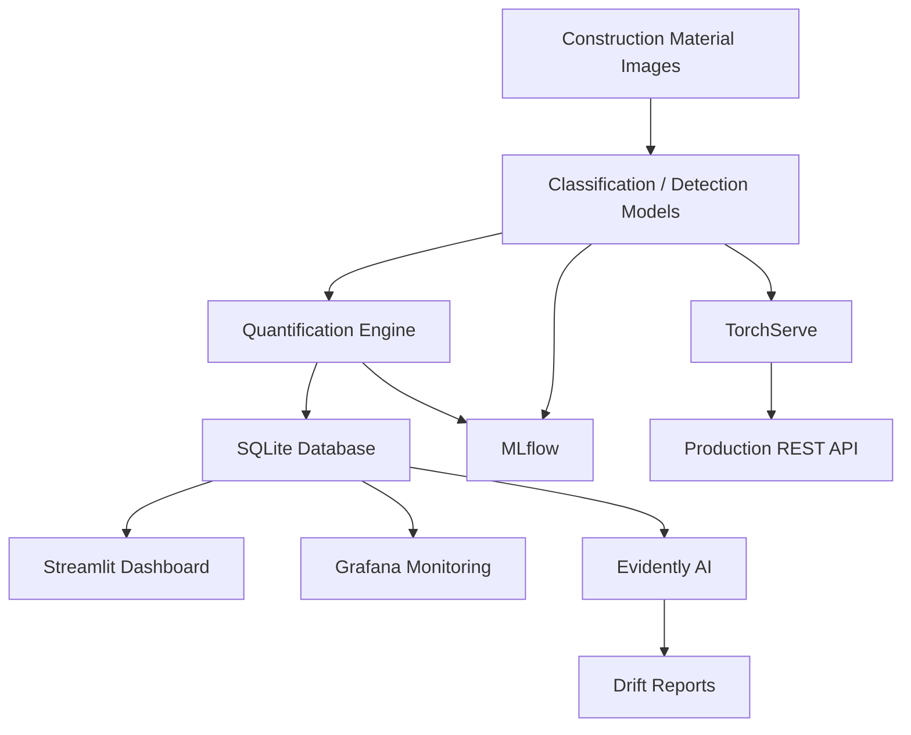

# 🏗️ Construction Material AI — End-to-End MLOps System

> An end-to-end MLOps pipeline for construction material classification, detection, quantification, monitoring, and production model serving.

This project demonstrates an end-to-end MLOps workflow for **construction material intelligence**, covering model development, data versioning, experiment tracking, quantification, drift monitoring, interactive dashboards, and production-grade model serving.

---

## 📌 Problem Statement

Manual identification and analysis of construction materials can be:

- Time-consuming
- Error-prone
- Difficult to monitor over time

This system automates:

1. Material identification
2. Material detection
3. Quantification of continuous materials
4. Monitoring for data and prediction drift
5. Production inference using TorchServe

---

## 🏗️ System Architecture



### High-Level Flow

**Images → Classification / Detection → Quantification → SQLite Database**

The system additionally integrates:

- **MLflow** for experiment tracking and model registry
- **DVC** for dataset versioning and reproducibility
- **Evidently AI** for drift detection
- **Streamlit** for the interactive application
- **Grafana** for monitoring and analytics
- **TorchServe** for model serving

---

## 🧠 Models Used

| Task | Model | Approach |
|---|---|---|
| Classification | ResNet-101 | Transfer learning with frozen backbone and fine-tuned classifier head |
| Detection | YOLOv8 | Bounding-box detection per material with confidence-based filtering |
| Quantification | Custom algorithms | Count, volume, and mass estimation |

### 1. Classification

**ResNet-101**

- Transfer learning
- Frozen backbone
- Fine-tuned classifier head

### 2. Detection

**YOLOv8**

- Bounding-box detection per material
- Confidence-based filtering

### 3. Quantification

The quantification module supports:

- Material counting
- Volume estimation
- Mass estimation

---

## 🛠️ Tech Stack

- **Language:** Python
- **Deep Learning:** PyTorch
- **Classification:** ResNet-101
- **Object Detection:** YOLOv8
- **Data Versioning:** DVC
- **Experiment Tracking & Model Registry:** MLflow
- **Drift Detection:** Evidently AI
- **Model Serving:** TorchServe
- **Application:** Streamlit
- **Monitoring:** Grafana
- **Database:** SQLite

---

## 📂 Project Structure

```text
construction-material-ai-mlops/
│
├── .dvc/
├── configs/
│   └── data.yaml
│
├── data/
│   ├── material_data.db
│   └── raw/
│       ├── Classification.dvc
│       └── Detection.dvc
│
├── frontend/
│   ├── ui/
│   └── app.py
│
├── quantification/
│   ├── area_calc.py
│   ├── counter.py
│   ├── density_constants.py
│   ├── utils.py
│   ├── visualize.py
│   └── volume_estimator.py
│
├── src/
│   ├── ml/
│   ├── database/
│   ├── drift/
│   └── serve/
│
├── .dvcignore
├── .gitignore
├── dvc.yaml
├── dvc.lock
├── project_structure.md
├── quantification_test.py
├── README.md
└── requirements.txt
```

> Large datasets, trained model weights, MLflow artifacts, logs, and generated reports are intentionally excluded from Git tracking. DVC metadata is committed to the repository for reproducibility.

---

## 🔁 Data Version Control (DVC)

### Why DVC?

Git is not designed for large datasets. DVC is used to:

- Version large datasets
- Keep datasets separate from Git
- Reproduce experiments
- Maintain dataset and pipeline consistency

### DVC-Managed Data

The project tracks the following datasets through DVC:

```text
data/raw/Classification
data/raw/Detection
```

Their corresponding DVC metadata files are committed to Git:

```text
data/raw/Classification.dvc
data/raw/Detection.dvc
```

### Reproduce the Pipeline

```bash
dvc repro
```

---

## 📊 Experiment Tracking & Model Registry

### MLflow

MLflow is used for:

- Experiment tracking
- Metric comparison
- Artifact storage
- Model registration and versioning
- System metrics logging

During training, the system records:

- Training loss
- Validation metrics
- Learning rate
- CPU/GPU metrics
- Model artifacts

### Start MLflow UI

```bash
mlflow ui
```

---

## 🗄️ Database — SQLite

SQLite is used as a lightweight persistence layer because it requires zero configuration and is suitable for the local MLOps pipeline.

### Tables

The system stores information related to:

| Table | Purpose |
|---|---|
| `images` | Uploaded images |
| `detections` | Bounding boxes and confidence values |
| `quantification` | Count, volume, and mass information |

All predictions are persistently logged.

---

## 📉 Drift Detection — Evidently AI

Models can degrade over time because of:

- Data distribution changes
- Sensor changes
- New material variations

### Drift Metrics

The system monitors:

- Confidence drift
- Bounding-box area drift
- Count drift
- Volume drift
- Mass drift

### Reference vs Current Data

The project uses:

- First 30 predictions → reference data
- Remaining predictions → current data

### Generate Drift Report

```bash
python src/drift/drift_report.py
```

The resulting interactive HTML report can be viewed through the Streamlit application.

---

## 📊 Streamlit Dashboard

The Streamlit dashboard provides:

- Material distribution
- Detection density
- Quantification analytics
- Recent predictions
- Drift report visualization

### Run the Application

```bash
streamlit run frontend/app.py
```

---

## 📈 Grafana Monitoring

Grafana is used for:

- Advanced analytics
- SQL-based dashboards
- Visual monitoring

### Data Source

```text
SQLite database
```

### Dashboard Includes

- Counts per material
- Detection statistics
- Quantification summaries
- Aggregated analytics

The Grafana dashboard can be embedded directly into the Streamlit application.

---

## 🚀 Model Serving — TorchServe

TorchServe provides:

- Production-ready inference
- REST APIs
- Scalable model serving
- Custom inference handlers

### Create a Model Archive

```bash
torch-model-archiver ^
  --model-name material ^
  --version 1.0 ^
  --serialized-file models/classification/resnet101.pth ^
  --handler src/serve/material_handler.py ^
  --extra-files src/serve/classes.json ^
  --export-path model_store ^
  --force
```

### TorchServe Configuration

```text
inference_address=http://127.0.0.1:8080
management_address=http://127.0.0.1:8081
metrics_address=http://127.0.0.1:8082

model_store=model_store
default_workers_per_model=1

disable_token_authorization=true
enable_envvars_config=false
```

### Start TorchServe

```bash
torchserve --start --ncs ^
  --model-store model_store ^
  --models material=material_classifier.mar ^
  --ts-config config.properties
```

### Test Inference

```bash
curl -X POST http://127.0.0.1:8080/predictions/material ^
  -H "Content-Type: application/octet-stream" ^
  --data-binary "@image.jpg"
```

### 🔐 Security Note

Token authentication is disabled for local development. It should be enabled when deploying TorchServe in a production environment.

---

## 🚀 Getting Started

### 1. Clone the Repository

```bash
git clone https://github.com/zaid-sharieff/construction-material-ai-mlops.git
cd construction-material-ai-mlops
```

### 2. Create a Python Environment

```bash
python -m venv venv
```

#### Windows

```bash
venv\Scripts\activate
```

### 3. Install Dependencies

```bash
pip install -r requirements.txt
```

### 4. Retrieve DVC Data

If a DVC remote is configured and accessible:

```bash
dvc pull
```

### 5. Run the Application

```bash
streamlit run frontend/app.py
```

Additional services such as MLflow, Grafana, and TorchServe can be started independently as described above.

---

## 🧪 Reproducibility Checklist

| Component | Tool |
|---|---|
| Data versioning | DVC |
| Pipeline reproduction | DVC |
| Experiment tracking | MLflow |
| Model registry | MLflow |
| Model serving | TorchServe |
| Drift detection | Evidently AI |
| Monitoring | Grafana |
| User interface | Streamlit |
| Database | SQLite |

---

## 🎯 Project Highlights

This project demonstrates:

- End-to-end MLOps lifecycle
- Dataset versioning with DVC
- Reproducible ML pipelines
- Experiment tracking and model registry with MLflow
- Construction material classification
- Construction material object detection
- Material quantification
- Prediction and data drift monitoring
- Interactive Streamlit dashboards
- Grafana-based analytics
- Production-oriented model serving with TorchServe

---

## 🔮 Future Extensions

The system can be extended with:

- CI/CD pipelines
- Cloud deployment
- Automated model retraining
- Cloud-based DVC storage
- Automated monitoring and alerting
- Production-scale deployment

---

## 🏁 Conclusion

The **Construction Material AI — End-to-End MLOps System** demonstrates how machine learning models can be integrated into a complete MLOps lifecycle rather than being treated as isolated training scripts.

The project combines:

**Data Versioning → Model Training → Experiment Tracking → Quantification → Drift Detection → Monitoring → Model Serving → Interactive Application**

to provide a reproducible and production-oriented construction material intelligence pipeline.
